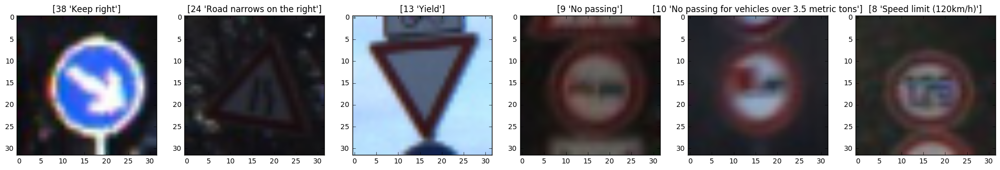
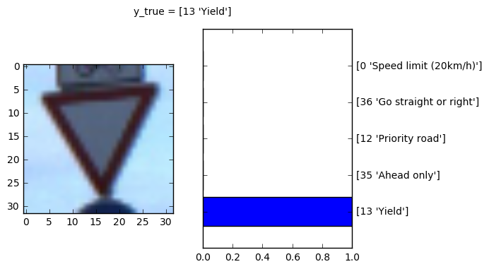
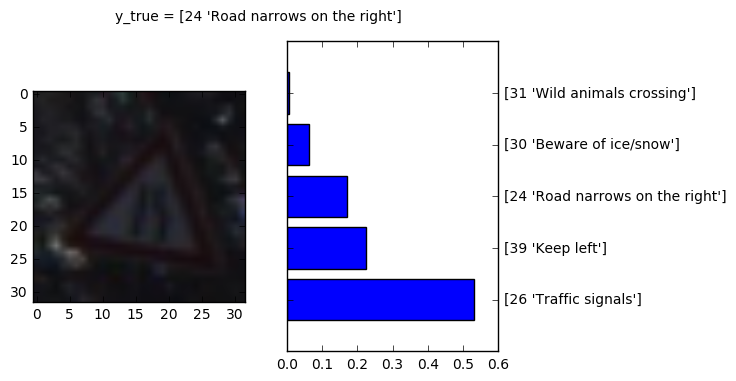

# Traffic Sign Classifier 

This is a writeup for 2nd project of Self-Driving Car NanoDegree from Udacity.

### Goals & steps of the project
* Load the data set (see below for links to the project data set)
* Explore, summarize and visualize the data set
* Design, train and test a model architecture
* Use the model to make predictions on new images
* Analyze the softmax probabilities of the new images
* Summarize the results with a written report

### Jupyter Notebook

* Source Code: [Traffic_Sign_Classifier.ipynb](./Traffic_Sign_Classifier.ipynb)

### Basic summary of the data set

* Download dataset: [traffic-signs-data.zip](https://d17h27t6h515a5.cloudfront.net/topher/2017/February/5898cd6f_traffic-signs-data/traffic-signs-data.zip)
* The size of training set is 34799
* The size of validation set is 4410
* The size of test set is 12630
* The shape of a traffic sign image is (32, 32, 3)
* The number of unique classes/labels in the data set is 43

### Exploratory visualization on the data set

This bar chart shows the data distribution of the training data. Each bar represents one class (traffic sign) and how many samples are in the class. The mapping of traffic sign names to class id can be found here: [signnames.csv](./signnames.csv)

Here are some traffic signs from the training data set. More can be found in the jupyter notebook.

### Design and Test a Model Architecture

#### Preprocessing

The images of the training dataset have 3 color channels. I reduced the channels to only one by converting them to grayscale images (YCrCb color space) to reduce the amount of input data and accelerate model training.

I normalized the data before training for mathematical reasons. Normalized data can make the training faster and reduce the probability of getting stuck in local optima.

#### Model Architecture
 
I used a convolutional neuronal network(LeNet-5 architecture) to classify the traffic signs. The input of the network is an 32x32x1 image and the output is the probabilty of each of the 43 possible traffic signs.
 
 My final model consisted of the following layers:

| Layer         		|     Description	        					| Input |Output| 
|:---------------------:|:---------------------------------------------:| :----:|:-----:|
| Convolution 5x5     	| 1x1 stride, valid padding, RELU activation 	|**32x32x1**|28x28x48|
| Max pooling			| 2x2 stride, 2x2 window						|28x28x48|14x14x48|
| Convolution 5x5 	    | 1x1 stride, valid padding, RELU activation 	|14x14x48|10x10x96|
| Max pooling			| 2x2 stride, 2x2 window	   					|10x10x96|5x5x96|
| Convolution 3x3 		| 1x1 stride, valid padding, RELU activation    |5x5x96|3x3x172|
| Max pooling			| 1x1 stride, 2x2 window        				|3x3x172|2x2x172|
| Flatten				| 3 dimensions -> 1 dimension					|2x2x172| 688|
| Fully Connected | connect every neuron from layer above			|688|84|
| Fully Connected | output = number of traffic signs in data set	|84|**43**|

#### Model Training

I trained the model on my local machine with a GPU (NVIDA GeForce GTX 1080Ti).

Here are my final training parameters:
* EPOCHS = 30
* BATCH_SIZE = 128
* SIGMA = 0.1
* OPIMIZER: AdamOptimizer (learning rate = 0.001)

My results after training the model:
* Validation Accuracy = **96.6%**
* Test Accuracy = **95.5%**

#### Solution Approach

This is a modification of LeNet-5 model architecture that works with the input shape of 32x32x1 instead of 32x32x3 with additional convolutional layer (Layer 3). The validation accuracy of original model was about 90%, but its testing accuracy was much lower (about 81%), so I added one more convolutional layer and got better results. You can see the final model architecture above. Training for more than 30 epochs does not increase the validation accuracy. More training than 30 epoches would rather resulted in overfitting and thus, 30 epoches will be enough.

### Test on new images

#### Acquiring New Images

I downloaded the new images from [GTSRB online-testing dataset](http://benchmark.ini.rub.de/?section=gtsrb&subsection=dataset#Downloads). Here are 6 examples I collected.

The signs "speed limit 30", "yield, stop", "no entry" and "keep right" should be easy to detect, because they are clearly visible and there are lots of examples in the training set. The "priority road" sign should be a little bit tricky, because there are only parts of the sign visible. The last sign is just to see what the model predict.

#### Performance on New Images

| Image										  | Prediction									  | 
|:-------------------------------------------:|:---------------------------------------------:| 
| Keep Right								  | Keep Right									  | 
| Road Narrows on Right 					  | Traffic Signals								  |
| Yield										  | Yield										  |
| No Passing								  | No Passing									  |
| No Passing For Vehicles Over 3.5 Metric Tons| No Passing For Vehicles Over 3.5 Metric Tons  |
| Speed Limit (120km/h)						  | Speed Limit (120km/h)						  |

5 of 6 correct = **83.3 %**

If you look at the 6 new images, 5 of them are correct. That's an accuracy of 83.3 %, which is much lower than the accuracy of the test set (95.5 %), but with such a small set of images you can not calculate a good accuracy. You need more images.

#### Softmax Probabilities

**Prediction correct**

Everything good here, very confident with its prediction.

**Prediction false**

The road narrows on the right sign, correct solution is on the third place with less than 20 %

### Resources
* Source code: [Traffic_Sign_Classifier.ipynb](./Traffic_Sign_Classifier.ipynb)
* Pickle files: [traffic-signs-data.zip](https://d17h27t6h515a5.cloudfront.net/topher/2017/February/5898cd6f_traffic-signs-data/traffic-signs-data.zip)
* Original data set: [German Traffic Sign Data Set](http://benchmark.ini.rub.de/?section=gtsrb&subsection=dataset)
* LeNet-5: [Gradient-Based Learning Applied to Document Recognition](http://yann.lecun.com/exdb/publis/pdf/lecun-01a.pdf)
* Project specification: [Udacity Rubrics](https://review.udacity.com/#!/rubrics/481/view)
* Udacity repository: [CarND-Traffic-Sign-Classifier-Project](https://github.com/udacity/CarND-Traffic-Sign-Classifier-Project)
* [Udacity Self Driving Nanodegree](http://www.udacity.com/drive)
